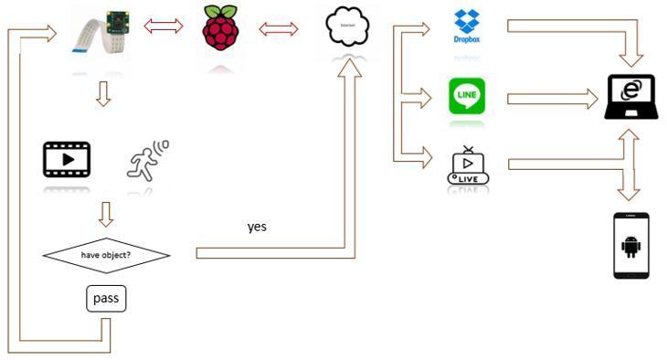

## Surveillance Camera Using Raspberry Pi

This project aims to make a surveillance camera using motion detection using **Raspberry Pi** and **Android**. System will take pictures automatically  when there are have moving objects and notify to the user. In addition, the resulting image will be automatically upload in to the  cloud storage **Drobox**. Picture bellow this is the block diagram that represent about this project



### Install requirements

you need to set you working environment as a project requirement,   you can make a virtual environment and install the important library following this command line:

```
$ pip install -r requirements.txt
```

### Running the program

you can running use following command bellow this:

```
$ python main.py
```

### Motion detection based on face detection open-cv


Using LINE notify can send the automatic announcement when have object detected


Then the system will automatically upload the picture to cloud storage (Dropbox)

 

### Video demo 

<video width="700" controls>
  <source src="./asset/Produce_0.mp4" type="video/mp4">
</video>
